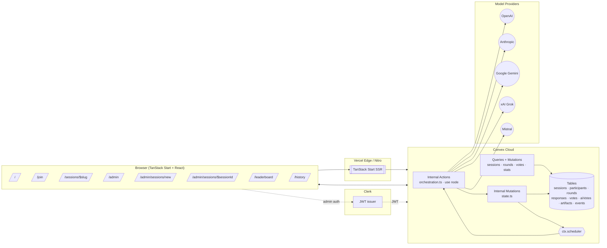
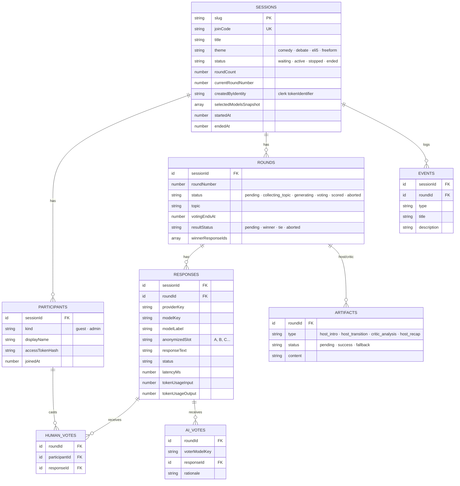
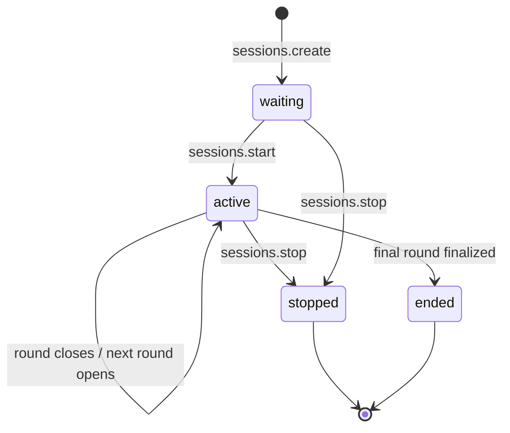
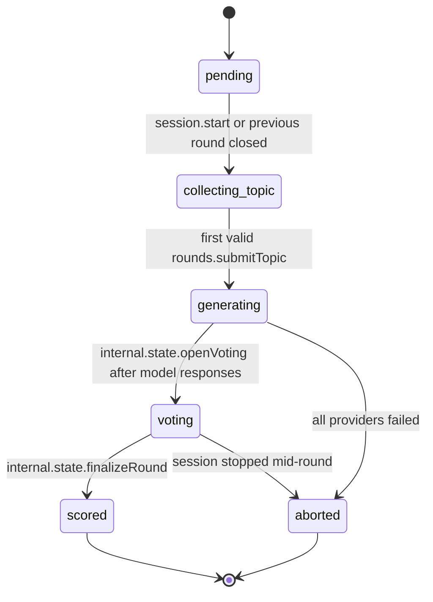
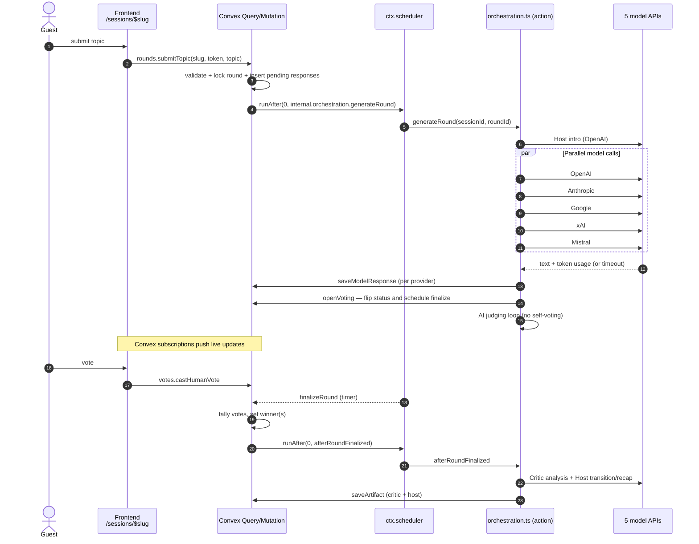
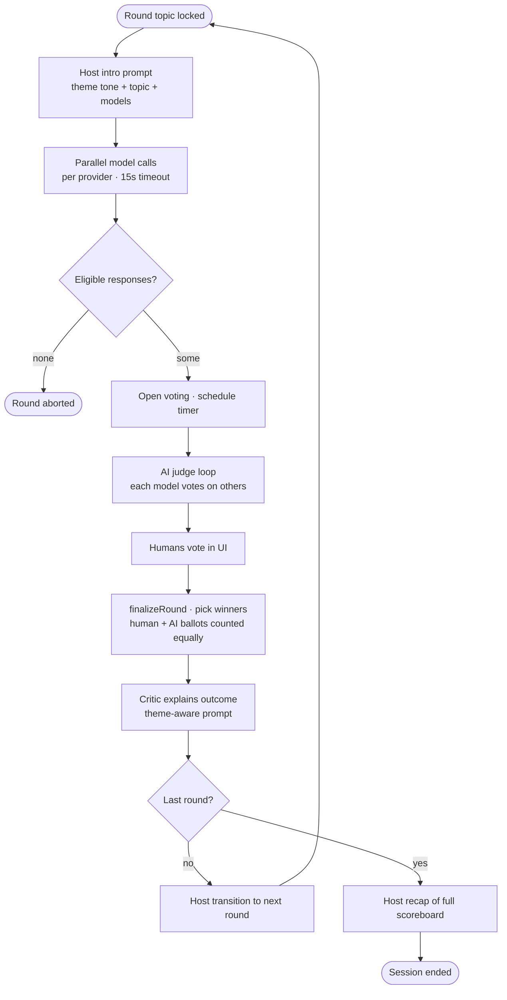
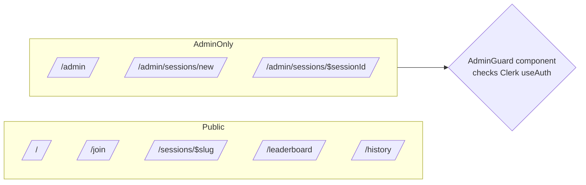

# AI Arena — Architecture

This document describes the system structure, the core data model, and the
runtime flows of AI Arena. The diagrams use Mermaid, which renders natively on
GitHub.

## 1. Component architecture



### Layers

- **Frontend** — TanStack Router file-based routes in `src/routes/*`. Live
  session data is subscribed via `convex/react` for realtime updates.
- **SSR host** — Nitro with the `vercel` preset (`vite.config.ts`). Delivers
  streamed HTML from TanStack Start.
- **Backend** — Convex functions split into **public** (`query` + `mutation`)
  and **internal** state machine / orchestration pieces.
- **Auth** — Clerk provides JWT identity for admin users. Guests authenticate
  against the session with a signed access token stored in localStorage.
- **Model providers** — Five SDKs called from the Node runtime action in
  `convex/orchestration.ts`, each with a fixed timeout and error fallback.

## 2. Entity-Relationship



The canonical definition lives in `convex/schema.ts`. Every table gets the
system-managed `_id` and `_creationTime`, but the schema also records
domain-specific `createdAt`, `startedAt`, and similar timestamps for clarity and
query ergonomics.

## 3. Session lifecycle



## 4. Round lifecycle



## 5. Core round sequence



## 6. Agent workflow



Prompt strings live alongside the orchestration action
(`buildHostPrompt`, `buildCriticPrompt`, `buildJudgePrompt`,
`buildRoundPrompt` in `convex/orchestration.ts`).

## 7. Scoring rules

- Each human vote counts as **one ballot**.
- Each eligible AI judge (a model that did not author the response) casts **one
  ballot** per round.
- Ties are recorded explicitly as `resultStatus: 'tie'` and multiple winner IDs
  are kept in `rounds.winnerResponseIds`.
- Failures are not silently dropped: a model that errors out simply receives no
  vote but the round still runs for the remaining responses.

## 8. Public vs admin surfaces



Admin APIs (`sessions.create`, `sessions.start`, `sessions.stop`,
`rounds.endVotingEarly`, `stats.getAdminCostSummary`) always re-derive the
identity via `ctx.auth.getUserIdentity()` — no `userId` is ever accepted as an
argument.

## 9. Deployment topology

- **Frontend / SSR** — built with `pnpm build` → Nitro `vercel` preset → Vercel
  Edge + Serverless functions.
- **Backend / realtime** — Convex Cloud. Function code in `convex/*` is pushed
  with `convex dev` (development) or `convex deploy --cmd "pnpm build"` (CI).
- **Auth** — Clerk issues JWTs; Convex validates them via
  `convex/auth.config.ts`.

## 10. Testing surface

- `shared/validation.test.ts` — zod schemas, pricing helpers, theme copy
- `convex/sessions.test.ts` — create + start + topic locking
- `convex/voting.test.ts` — topic validation, state machine, stats queries

Run everything with:

```bash
pnpm check  # format + lint + typecheck + test
pnpm build
```
