# UML Diagrams

This document contains the MDS-facing UML diagrams for AI Arena. Each diagram is
shown first as a committed SVG image so it renders consistently in Firefox,
Zen, Chromium-based browsers, and GitHub previews. The Mermaid source remains
below each image so the diagrams stay editable and reviewable in pull requests.

## 1. Use Case Diagram


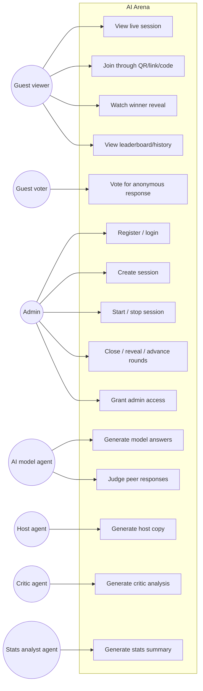

## 2. Class / Domain Model Diagram


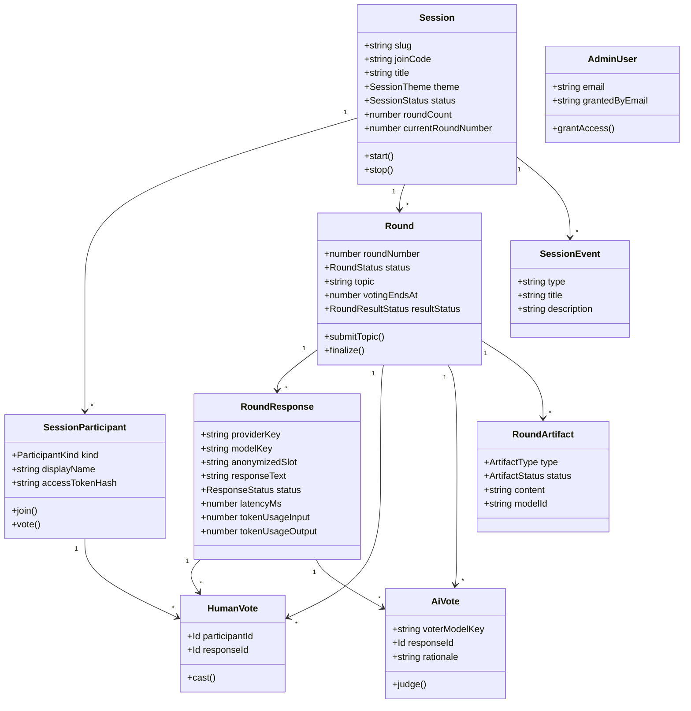

## 3. Round Sequence Diagram

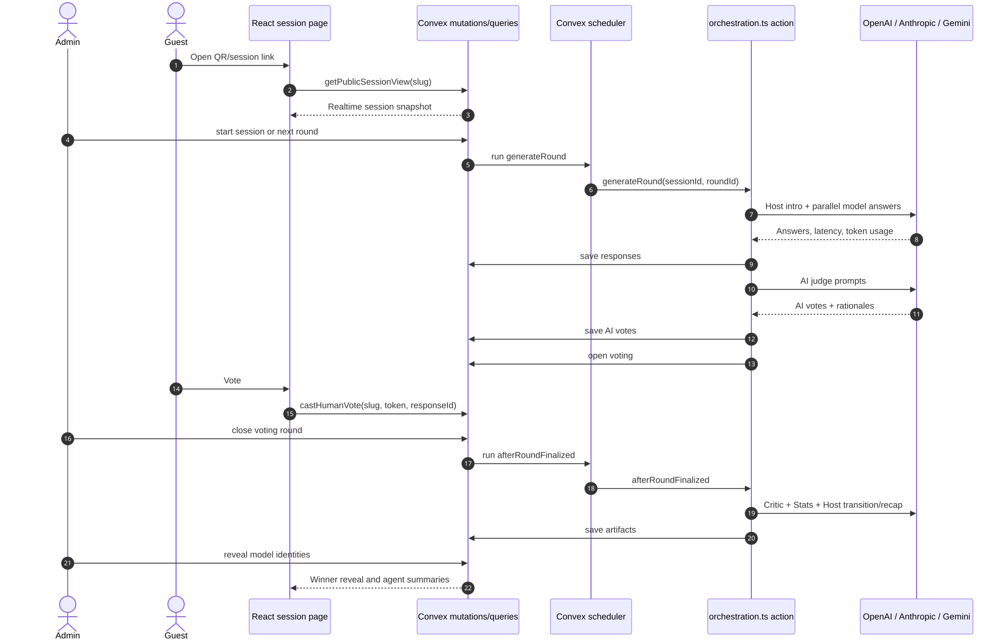

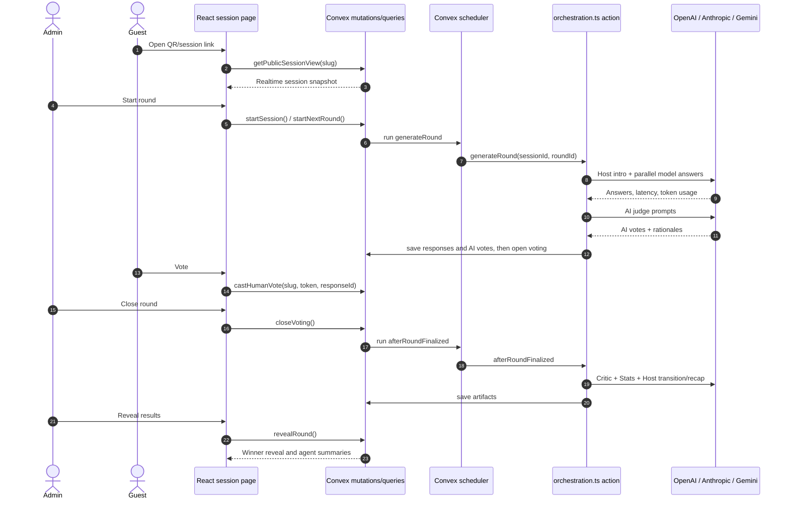

## 4. Activity Diagram


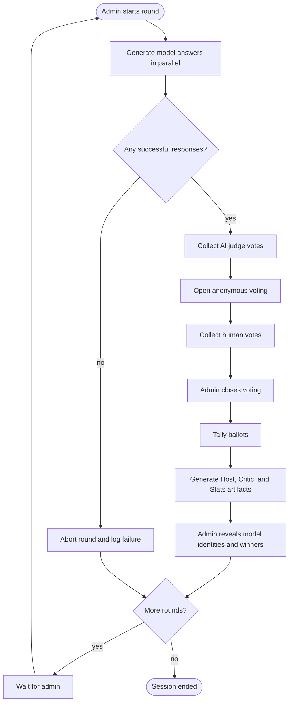

## 5. State Machine Diagram


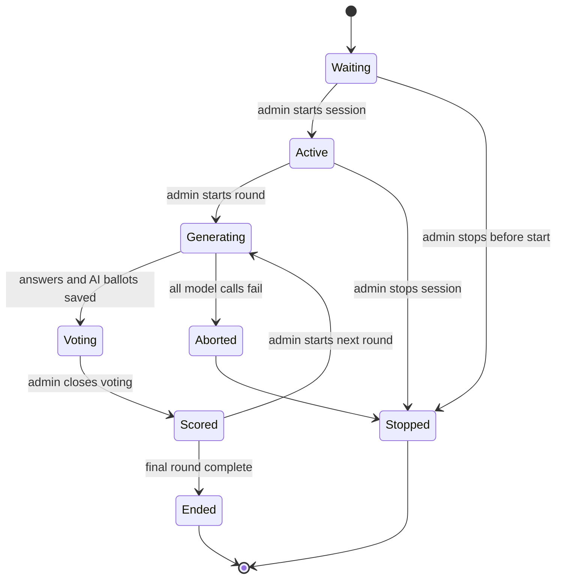

## 6. Deployment Diagram


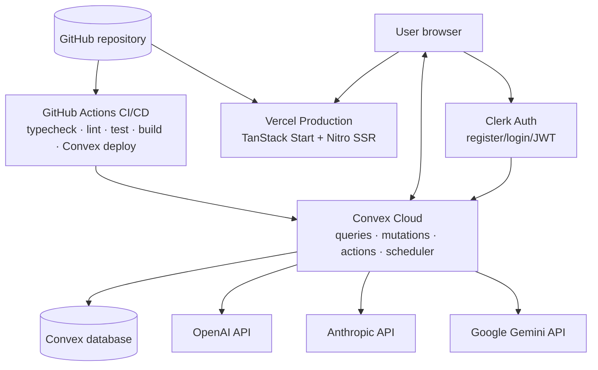

## How To View

Open this file on GitHub:

```text
https://github.com/Radu028/ai-arena/blob/main/docs/UML_DIAGRAMS.md
```

GitHub renders the committed SVG images in any modern browser. The Mermaid
blocks are kept as source. If a separate offline image is needed for slides, use
the SVG files in `docs/diagrams/svg/` directly.
